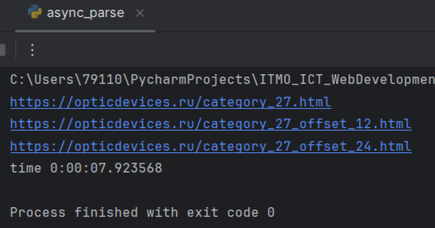
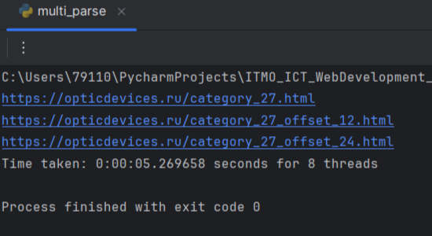
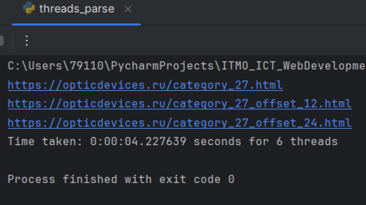
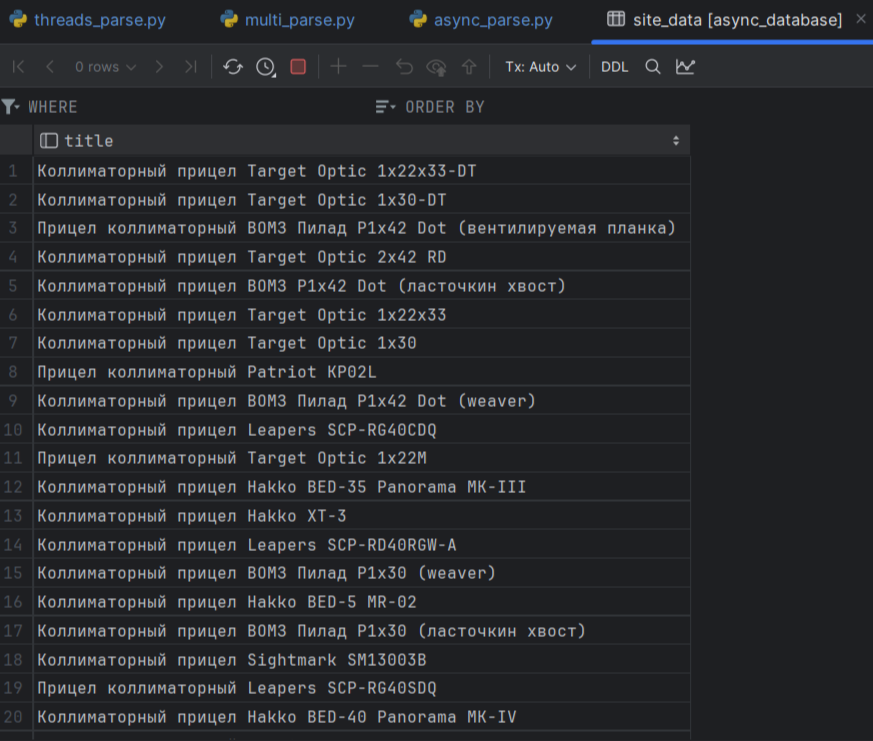

# Лабораторная работа №2

Потоки. Процессы. Асинхронность.

## Цель лабораторной работы

Понять отличия потоками и процессами и понять, что такое асинхронность в Python.

## Описание работы

Задачи:

* Различия между threading, multiprocessing и async в Python.

Напишите три различных программы на Python, использующие каждый из подходов: threading, multiprocessing и async. Каждая программа должна решать считать сумму всех чисел от 1 до 1000000. Разделите вычисления на несколько параллельных задач для ускорения выполнения.

* Параллельный парсинг веб-страниц с сохранением в базу данных

Напишите программу на Python для параллельного парсинга нескольких веб-страниц с сохранением данных в базу данных с использованием подходов threading, multiprocessing и async. Каждая программа должна парсить информацию с нескольких веб-сайтов, сохранять их в базу данных.


## Реализация

### `async.py`
```python
import asyncio

async def sum_range(s, e):
    total = 0
    for j in range(s, e + 1):
        total += j
    return total


async def main():
    tasks = [
        asyncio.create_task(sum_range(1, 125000)),
        asyncio.create_task(sum_range(125001, 250000)),
        asyncio.create_task(sum_range(250001, 500000)),
        asyncio.create_task(sum_range(500001, 750000)),
        asyncio.create_task(sum_range(750001, 1000001)),
    ]
    results = await asyncio.gather(*tasks)
    print(f"Sum: {sum(results)}")


start_time = time.time()
asyncio.run(main())
end_time = time.time()
print(f"time {end_time - start_time}")
```

## Результаты работы 


Парсинг при помощи библиотеки async занял 7 секунд.



Парсинг при помощи библиотеки multiprocessing занял 5 секунд.



Парсинг при помощи библиотеки threading занял 4 секунды.



На этом фото можно наблюдать вывод из базы данных после парсинга.
